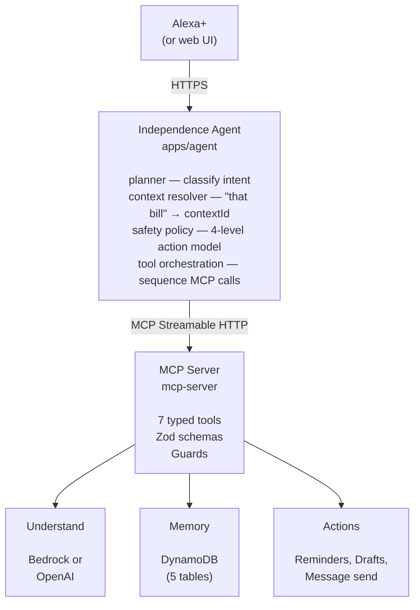
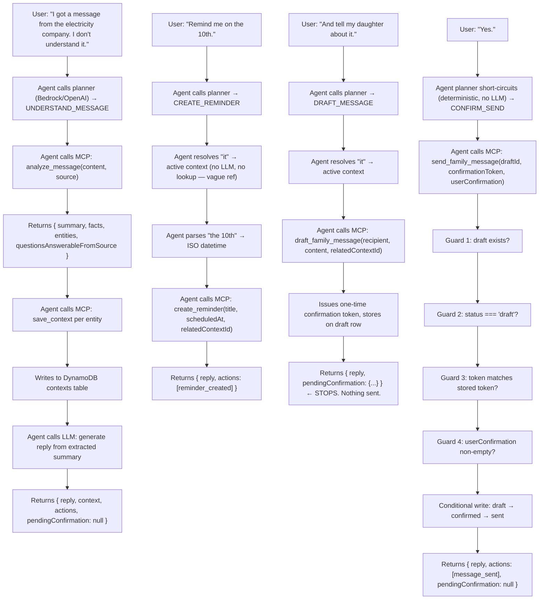

# Architecture

## The claim

The product is not a chatbot. It is an **orchestration layer** that turns an
ambiguous everyday problem into a safe, multi-step workflow. The architecture
exists to make that claim true in code.

## Component map

## Responsibilities

| Layer | Owns | Must not |
|---|---|---|
| **Web UI** | Conversation display, voice input, visible confirmation gate | Reach the MCP server directly |
| **Agent** (`apps/agent`) | Intent classification, reference resolution, safety policy, tool sequencing, response generation | Touch DynamoDB; decide whether a send is authorized |
| **MCP Server** (`mcp-server`) | Capability exposure, input validation, guard enforcement | Contain agent reasoning; decide *when* to send |
| **DB layer** (`mcp-server/src/db`) | Persistent state, conditional writes | Expose raw CRUD to the agent |
| **AWS** | Reasoning (Bedrock), state (DynamoDB), deployment (AgentCore) | Be decorative |

## Data flow for the hero scenario

## Why the agent and MCP server are separate processes

1. **Swap the entry point without touching the orchestrator.** Real Alexa+ MCP Toolkit access would replace the web UI. The agent, MCP server, and data layer stay identical.

2. **Enforce the safety gate at the capability boundary.** The agent decides when to *ask*; the MCP server decides whether to *execute*. Neither trusts the other. A compromised or confused agent cannot force a send.

3. **Match Amazon's deployment model.** AgentCore hosts MCP servers over Streamable HTTP. Building against that boundary means the deployment story is already true.

## Why `buildServer()` is a separate file

`mcp-server/src/build-server.ts` constructs an `McpServer` with all seven tools registered. `server.ts` binds it to Express and a port. Tests import `buildServer` directly and connect over `InMemoryTransport`, so the same code path is exercised without opening a socket. Separation of construction from deployment is what makes the tool tests fast and reliable.

## Latency budget

Amazon's Alexa+ MCP requirements specify a 500ms round-trip budget per query. Our pipeline:

| Stage | Typical |
|---|---|
| Planner (LLM classification, short prompt) | 200–400ms |
| `analyze_message` (deterministic extractor) | <5ms |
| `save_context` (DynamoDB write) | 10–20ms |
| Response generation (LLM, short prompt) | 300–600ms |

The two LLM calls dominate. For the demo, this is acceptable — the total is under 1.5s wall-clock, and the extraction path stays under 500ms on its own.

If tighter latency is needed later, the planner can be replaced with a classifier (fewer tokens, faster) and response generation can stream. Neither change affects the architecture.
